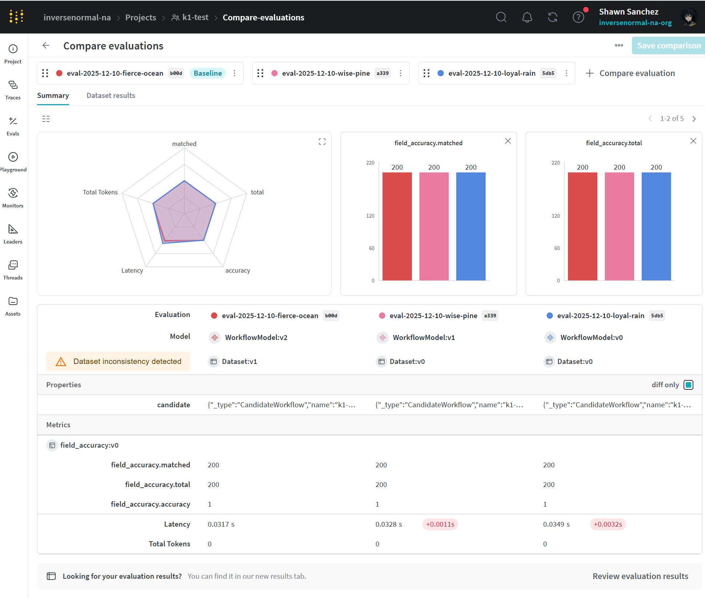

# tax-man


## Quick start: Document API

1. Start the API (from repo root):
```bash
uv run uvicorn document_api.app:app --reload --host 0.0.0.0 --port 8000
```
2. Upload a PDF (default: mock parse + regex):
```bash
curl -X POST "http://localhost:8000/documents?workflow=regex&use_mock_parser=true" \
  -F "file=@strategy/test/fixtures/MockParsePdfToMarkdown/input_pdf_docs/doc_1.pdf"
```
You’ll get back an `id`, parsed fields, and artifacts. For real parsing/LLM extraction, set `DATALAB_API_KEY` and/or `OPENROUTER_API_KEY` and toggle `use_mock_parser=false` / `workflow=llm&use_mock_llm=false`.
3. Inspect the run (PDF + every workflow step input/output):
```bash
curl http://localhost:8000/workflow/<document-id>
```


## Main Goal

- The main goal is to create one main *workflow* object - which takes in multiple *strategy* objects.

The workflow should aim to do these *activities* in order:

1. **Parse** the PDF document scan into a text format.
    - Strategy: `ParsePdfToDatalabMarkdown` should call the datalab API using the `.env.` `DATALAB_API_KEY` 
    - Strategy: `MockParsePdfToDatalabMarkdown` should return a mocked datalab API response, depending on the filename provided. We will store these mock responses in a test folder.
2. **Extract** all suspect numeric values from the markdown/text document. These should be saved in a dictionary format - as each number will be referenced.
3. **Extract** all field values from the markdown/text document. These should be saved in a dictionary format - each field should reference the most likely value(s).
    - Strategy: `ExtractRegexK1_V1.0.0` should utilize the regex functions per field.
    - Strategy: `ExtractRegexK1_VN.N.N` should allow testing future versions of this strategy - this comes into play using `weights-and-biases` module in order to determine the best performing strategy version against our datasets.
4. **Infer** whether or not there are any errors or failures to extract critical fields.
5. Webhook notification that workflow is completed.

## workflow

- A *workflow* consists of several *activity* objects. Activities will run in sequence.
- We can have multiple *versions* of a *workflow*. Different workflow versions can consist of different *strategy* objects, which applied to an activity, change how the activity is resolved.

## weights-and-biases

This stores the evaluation tooling in order to determine whether a given strategy version or workflow version performs better.

To add a run to leaderboard:

```sh
 uv run taxman-eval-wandb --dataset weights-and-biases/datasets/pdf-set-1 --project k1-test --entity inversenormal-na --strategy-version v1.0.0 --publish-leaderboard
```

Example view on dashboard:



## Running the workflows

All examples use `uv run` so they pick up the local workspace packages. Set `DATALAB_API_KEY` for real parsing and `OPENROUTER_API_KEY` for real LLM extraction when needed.

### Mock parse + regex extract (default)
```bash
uv run python - <<'PY'
from pathlib import Path
from workflow.k1 import build_k1_workflow
pdf = Path("strategy/test/fixtures/MockParsePdfToMarkdown/input_pdf_docs/doc_1.pdf")
workflow, context = build_k1_workflow(pdf_path=pdf, use_mock_parser=True)
result = workflow.run(context)
print(result.succeeded, context.field_values["partnership_name"])
PY
```

### Datalab parse + regex extract
```bash
uv run python - <<'PY'
from pathlib import Path
from workflow.k1 import build_k1_workflow
pdf = Path("your_pdf.pdf")
workflow, context = build_k1_workflow(pdf_path=pdf, use_mock_parser=False)
result = workflow.run(context)
print(result.succeeded, context.field_values.get("partnership_name"))
PY
```

### Datalab mock parse + regex extract
Use the first snippet with `use_mock_parser=True` and point `pdf` to a fixture name that exists in `strategy/test/fixtures/MockParsePdfToMarkdown`.

### Datalab real parse + mock LLM extract
```bash
uv run python - <<'PY'
from pathlib import Path
from workflow.k1 import build_k1_llm_extract_workflow
pdf = Path("your_pdf.pdf")
workflow, context = build_k1_llm_extract_workflow(
    pdf_path=pdf,
    use_mock_parser=False,
    use_mock_llm=True,
)
result = workflow.run(context)
print(result.succeeded, context.field_values.get("partnership_name"))
PY
```

### Datalab mock parse + real LLM extract
```bash
uv run python - <<'PY'
from pathlib import Path
from workflow.k1 import build_k1_llm_extract_workflow
pdf = Path("strategy/test/fixtures/MockParsePdfToMarkdown/input_pdf_docs/doc_1.pdf")
workflow, context = build_k1_llm_extract_workflow(
    pdf_path=pdf,
    use_mock_parser=True,
    use_mock_llm=False,
)
result = workflow.run(context)
print(result.succeeded, context.field_values.get("partnership_name"))
PY
```

### Datalab real parse + real LLM extract
```bash
uv run python - <<'PY'
from pathlib import Path
from workflow.k1 import build_k1_llm_extract_workflow
pdf = Path("your_pdf.pdf")
workflow, context = build_k1_llm_extract_workflow(
    pdf_path=pdf,
    use_mock_parser=False,
    use_mock_llm=False,
    llm_model="openai/gpt-4o-mini",
)
result = workflow.run(context)
print(result.succeeded, context.field_values.get("partnership_name"))
PY
```

## Document API workflow selection

When calling `POST /documents`, choose the workflow and mock/real modes via query params:
- `workflow` = `regex` (default) or `llm`
- `use_mock_parser` = `true` (default) for fixtures, `false` for the Datalab parser
- `use_mock_llm` = `true` for mock LLMs, `false` to hit OpenRouter (when `workflow=llm`)
- `llm_model` to pick an OpenRouter model (default `openai/gpt-4o-mini`)

Examples:
- All mock: `workflow=llm&use_mock_parser=true&use_mock_llm=true`
- Real parse + regex: `workflow=regex&use_mock_parser=false`
- Real parse + real LLM: `workflow=llm&use_mock_parser=false&use_mock_llm=false`

Use `GET /workflow/{document_id}` in the Document API to inspect a run: it returns the uploaded PDF (base64), every workflow step's input/output/artifacts, and the original response body for that document.
For a quick UI, open `GET /workflow/view`; it lists available IDs and lets you click through or paste a document ID.

## Weights & Biases logging and evals

- Set `WANDB_API_KEY` (and optionally `WANDB_ENTITY`/`WANDB_PROJECT`) then pass `enable_wandb=true` to the API to push workflow summaries to W&B. Local run logs can also be persisted with `write_log_file=true` (saved under `document-api/run-logs/`).
- To run an evaluation sweep that reports to W&B, use the bundled CLI:  
  `uv run taxman-eval-wandb --dataset datasets/pdf-set-1 --project tax-man/k1-test --strategy-version v1.0.0 --publish-leaderboard`
