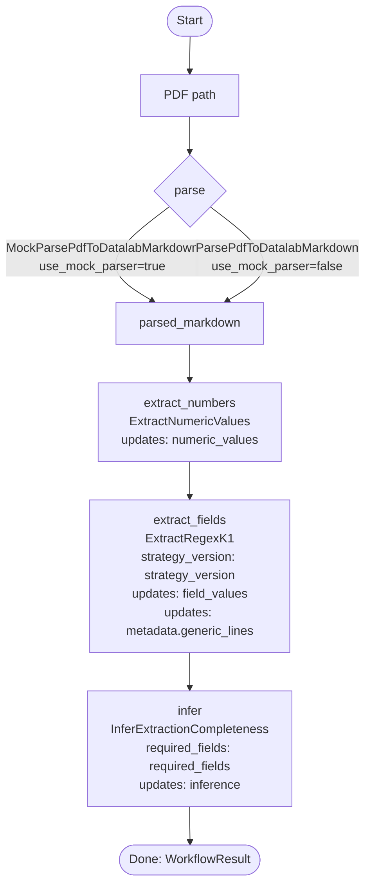
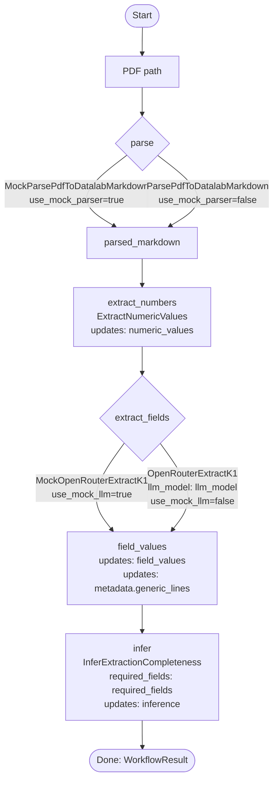

# workflow

Lightweight orchestration layer for sequencing strategy activities and tracking shared context.

## Configured workflows

Workflows are assembled in `workflow/src/workflow/k1.py`.

### `k1-workflow` (regex extract)

### `k1-llm-extract` (LLM extract)

